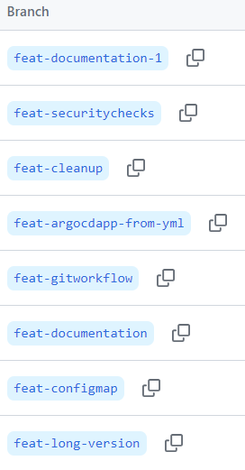
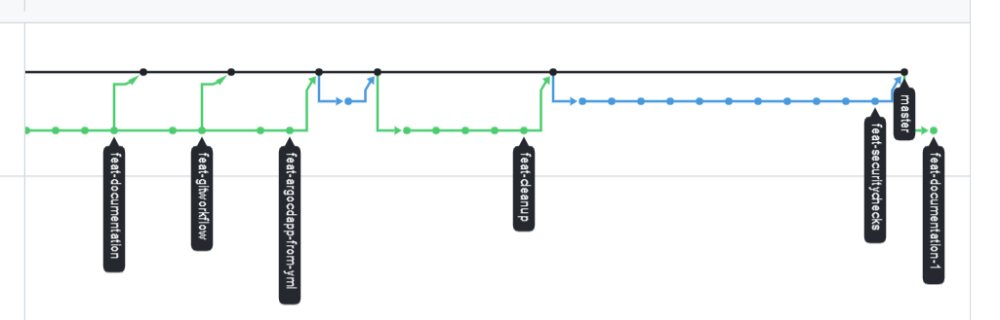

## 1. Project overview

This project produces a microservice which is deployed to a kubernetes cluster on AWS. Main idea is that it can be reused for other
more meaningfull microservice projects.

### 1.1 Microservice data

```json
{
    "service-name": "blue",           # configured inside ConfigMap during deployment
    "pod-ip-addr": "10.0.3.26",
    "pod-hostname": "",
    "version": "1.1",                 # version as defined by developer
    "version-long": "8-1.1-017472",   # generate by CI/CD
    "now": "2024-01-28 02:32:32",
    "seq-counter:": 11                # used to detect pod restart
}
```

### 1.2 Service version explained

Service version is generated by CI/CD and is available inside deployed service as environment variable.

```cpp
//  +--------------- Build version (GITHUB_RUN_NUMBER), incremented with each workflow execution
//  |   +----------- Software version extracted from source code
//  |   |      +---- Git commit SHA (first 6 symbols)
//  |   |      |
    8-1.1-017472
```

## 2. Git branching strategy

1. `master` branch is protected. Require a pull request before merging. All commits must be made to a non-protected branch and submitted via a pull request before they can be merged into a branch that matches this rule.
2. All modifications happen throug _feature_ branches which should start with `feat-`
   * when ready a PR is created and `feat-` branch is merged to `master`

   
3. Deployments are done only from `master` branch through a CI\CI pipeline

   

## 3. CI/CD overview

```text
    GitHub
                  on pull request OK:
                    * gen Docker images
  +------------+    * gen deployment     +-----------+
  |  src_repo  | ----.     .-----------> | depl_repo |
  +------------+      \   /              +-----------+
                       \ /                 ^
                        V                  |
                    +-----------+          |
                    | Dockerhub |          |
                    |  repo     |          |
                    +-----------+          |
                                           |
    AWS                                    | monitor for changes
                                           |
   +---------------------------------------|--------+
   |    Kubernetes (AWS EKS)               |        |
   |                                  +--------+    |
   |        +-------------------------| ArgoCD |    |
   |        |     deploy              +--------+    |
   |        V                                       |
   |  +-----------+                                 |
   |  |  my app   |                                 |
   |  +-----------+                                 |
   +------------------------------------------------+

```

### 3.1 Application deployment repo

CI/CD pipeline updates [istio-tryout-deployment](https://github.com/yulian-matev/istio-tryout-deployment) repository with:

* all _.yml_ files from `deployment-template` directory
* inside all _.yml_ templates, patter `__TAG__` is replaced with generated docker image tag

## 4. Secrets and security

### 4.1. Secrets management

Following secrets are stored safely inside GibHub

* `DOCKERHUB_TOKEN` - used to push produced docker images to DockerHub
* `MY_GITHUB_TOKEN` - used for updating _deployment repo_ [istio-tryout-deployment](https://github.com/yulian-matev/istio-tryout-deployment)
* `SNYK_TOKEN`  - used for security scanner
* `SONAR_TOKEN` - used for security scanner

No secrets are kept inside ArgoCD because _deployment repo_ and _dockerhub repo_ are public.

### 4.2. Security checks

Several security checks are performed before software is deployed:

* Gitleaks - hardcoded secrets like passwords, api keys, and tokens in git repos.
* SonarCloud - code quality and security
* PHP syntax checker (lint)

## 6. Initalize AWS infrastructure

### Infrastructure precondition

For a successful infrastructure provisioning we need:

* active AWS acount
* `terraform` installed locally
* `ansible`
* `istioctl`
* `kubectl`

    ```bash
      cd infrastructure-eks
      terraform init             # initialize backend - need to be called once
      # terraform plan           # optional
      terraform apply            # create/upddate infrastructure

    ```

### Configure local `kubectl` to access AWS EKS cluster

1. Confugre credentials for `awscli`

    ```bash
      asw cofigure

      # std input:
      #access_key: AKIxxxxxxxxxxxxxxxxx
      #secret_key: h6V/xxxxxxxxxxxxxxxxxxxxxxxxxxxxxxxxxxxx

    ```

2. Transfer credentials from `awscli` to `kubectl` (file `/home/user/.kube/config` gets updated):

    ```bash
    aws eks update-kubeconfig --region <region> --name <cluster-name>
    # aws eks update-kubeconfig --region eu-central-1 --name education-eks-iCgeDNNU
    ```


## Verify configuration

Following pods and services should be available:

```bash

# kubectl get pods,svc -A

NAMESPACE      NAME                                                   READY   STATUS    RESTARTS   AGE
argocd         pod/argocd-application-controller-0                    1/1     Running   0          16m
argocd         pod/argocd-applicationset-controller-dc5c4c965-vbpx2   1/1     Running   0          16m
argocd         pod/argocd-dex-server-9769d6499-vs7sr                  1/1     Running   0          16m
argocd         pod/argocd-notifications-controller-db4f975f8-pk2vp    1/1     Running   0          16m
argocd         pod/argocd-redis-b5d6bf5f5-lckwp                       1/1     Running   0          16m
argocd         pod/argocd-repo-server-579cdc7849-f89vq                1/1     Running   0          16m
argocd         pod/argocd-server-557c4c6dff-pk9ds                     1/1     Running   0          16m
istio-system   pod/grafana-5f9b8c6c5d-jsqvn                           1/1     Running   0          10m
istio-system   pod/istio-egressgateway-975ff4944-788gt                1/1     Running   0          10m
istio-system   pod/istio-ingressgateway-6cb9989d98-8z5xn              1/1     Running   0          10m
istio-system   pod/istiod-855f4b5f7-qlm8k                             1/1     Running   0          11m
istio-system   pod/jaeger-db6bdfcb4-wg95p                             1/1     Running   0          10m
istio-system   pod/kiali-cc67f8648-zdsbl                              1/1     Running   0          10m
istio-system   pod/prometheus-5d5d6d6fc-lpq68                         2/2     Running   0          10m
kube-system    pod/aws-node-fzcdz                                     2/2     Running   0          65m
kube-system    pod/aws-node-nzglg                                     2/2     Running   0          64m
kube-system    pod/coredns-6566899dc6-cljpq                           1/1     Running   0          67m
kube-system    pod/coredns-6566899dc6-jmq8m                           1/1     Running   0          67m
kube-system    pod/ebs-csi-controller-b5bd9b84-lrpx5                  6/6     Running   0          66m
kube-system    pod/ebs-csi-controller-b5bd9b84-m9zfc                  6/6     Running   0          66m
kube-system    pod/ebs-csi-node-b6g9h                                 3/3     Running   0          64m
kube-system    pod/ebs-csi-node-hjv9x                                 3/3     Running   0          65m
kube-system    pod/kube-proxy-r4nrv                                   1/1     Running   0          64m
kube-system    pod/kube-proxy-wdfmr                                   1/1     Running   0          65m

NAMESPACE      NAME                                              TYPE           CLUSTER-IP       EXTERNAL-IP                                                                  PORT(S)                                                                      AGE
argocd         service/argocd-applicationset-controller          ClusterIP      172.20.177.249   <none>                                                                       7000/TCP,8080/TCP                                                            17m
argocd         service/argocd-dex-server                         ClusterIP      172.20.32.122    <none>                                                                       5556/TCP,5557/TCP,5558/TCP                                                   17m
argocd         service/argocd-metrics                            ClusterIP      172.20.102.159   <none>                                                                       8082/TCP                                                                     16m
argocd         service/argocd-notifications-controller-metrics   ClusterIP      172.20.15.187    <none>                                                                       9001/TCP                                                                     16m
argocd         service/argocd-redis                              ClusterIP      172.20.83.243    <none>                                                                       6379/TCP                                                                     16m
argocd         service/argocd-repo-server                        ClusterIP      172.20.90.144    <none>                                                                       8081/TCP,8084/TCP                                                            16m
argocd         service/argocd-server                             ClusterIP      172.20.71.51     <none>                                                                       80/TCP,443/TCP                                                               16m
argocd         service/argocd-server-metrics                     ClusterIP      172.20.92.101    <none>                                                                       8083/TCP                                                                     16m
default        service/kubernetes                                ClusterIP      172.20.0.1       <none>                                                                       443/TCP                                                                      70m
istio-system   service/grafana                                   ClusterIP      172.20.165.132   <none>                                                                       3000/TCP                                                                     10m
istio-system   service/istio-egressgateway                       ClusterIP      172.20.73.171    <none>                                                                       80/TCP,443/TCP                                                               10m
istio-system   service/istio-ingressgateway                      LoadBalancer   172.20.145.17    ab0b424a5489d4dd48c77b34a83362e8-1038563620.eu-central-1.elb.amazonaws.com   15021:31259/TCP,80:32018/TCP,443:30892/TCP,31400:31639/TCP,15443:30040/TCP   10m
istio-system   service/istiod                                    ClusterIP      172.20.197.5     <none>                                                                       15010/TCP,15012/TCP,443/TCP,15014/TCP                                        11m
istio-system   service/jaeger-collector                          ClusterIP      172.20.128.90    <none>                                                                       14268/TCP,14250/TCP,9411/TCP,4317/TCP,4318/TCP                               10m
istio-system   service/kiali                                     ClusterIP      172.20.248.154   <none>                                                                       20001/TCP,9090/TCP                                                           10m
istio-system   service/prometheus                                ClusterIP      172.20.187.35    <none>                                                                       9090/TCP                                                                     10m
istio-system   service/tracing                                   ClusterIP      172.20.129.75    <none>                                                                       80/TCP,16685/TCP                                                             10m
istio-system   service/zipkin                                    ClusterIP      172.20.105.80    <none>                                                                       9411/TCP                                                                     10m
kube-system    service/kube-dns                                  ClusterIP      172.20.0.10      <none>                                                                       53/UDP,53/TCP                                                                67m
```


Access ArgoCD's web interface: `kubectl port-forward svc/argocd-server -n argocd 8080:443`


Observability Add-ons
```
# Visualize Istio Mesh console using Kiali
kubectl port-forward svc/kiali 20001:20001 -n istio-system

# Get to the Prometheus UI
kubectl port-forward svc/prometheus 9090:9090 -n istio-system

# Visualize metrics in using Grafana
kubectl port-forward svc/grafana 3000:3000 -n istio-system

# Visualize application traces via Jaeger
kubectl port-forward svc/jaeger 16686:16686 -n istio-system
```
